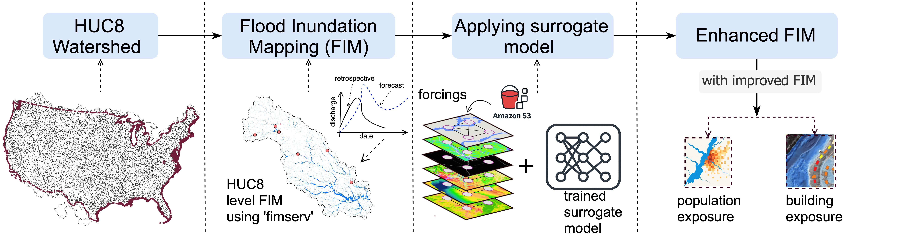
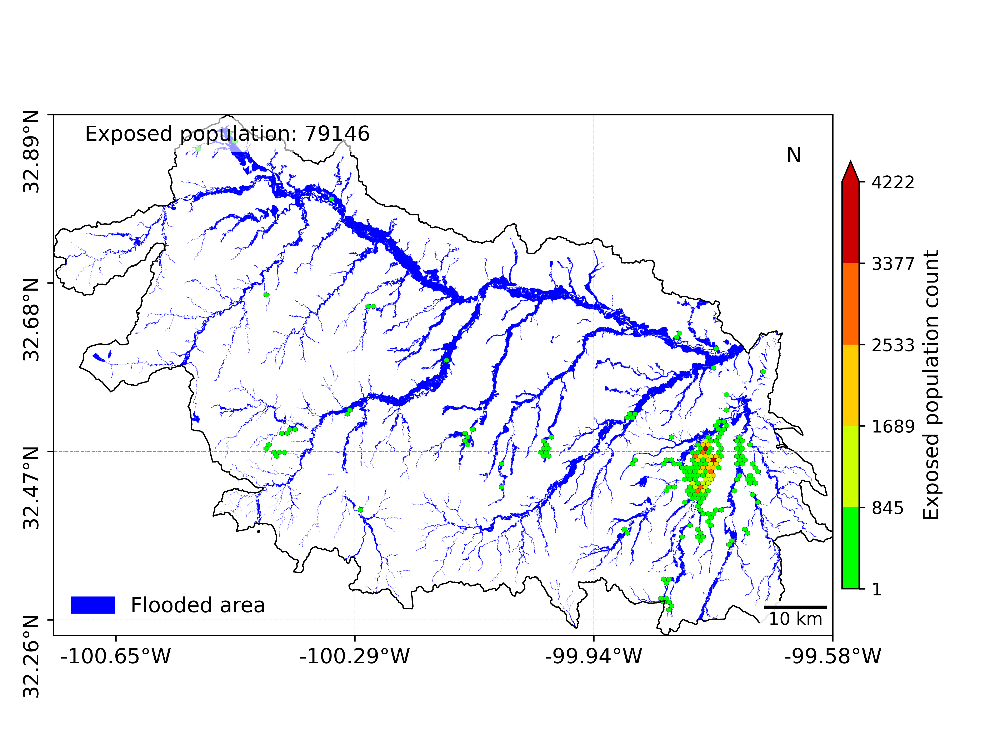
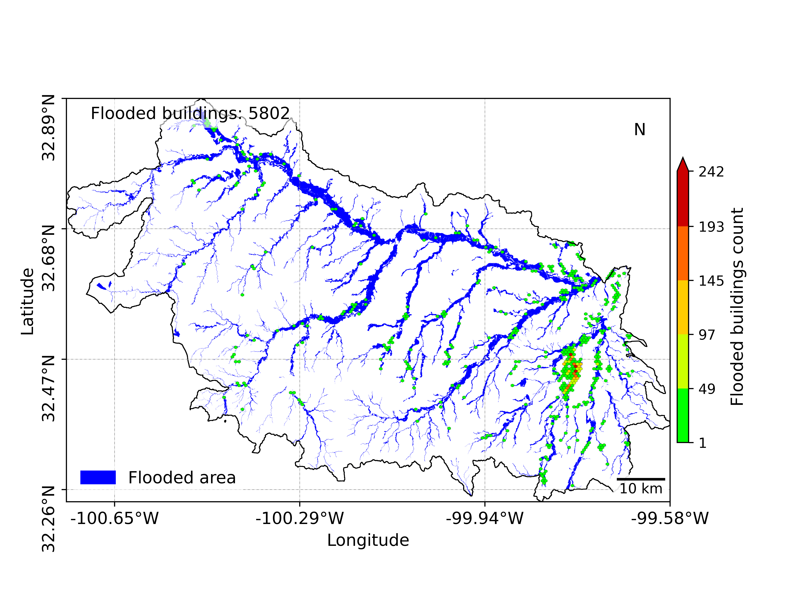

# Operational Enhanced FIM

## Overview

The **Operational Enhanced Flood Inundation Mapping (FIM)** framework provides a streamlined pipeline for real-time flood mapping and impact analysis. Its primary objective is to support emergency response operations by delivering timely, high-resolution flood information.

## Workflow

The core components of the framework are illustrated in the figure below:

## Key Capabilities

- **Real-time flood map generation** using surrogate models.
- **Automated processing pipeline** for rapid data acquisition, model execution, and visualization.
- **Scalable architecture** adaptable to different regions and data sources.

## Exposure Analysis

In addition to mapping flooded areas, the framework includes modules for:

- **Population exposure estimation**: Identifies the number of people affected by the flood event. For this it uses the population grids to analyze the exposed population. The framework provides the estimated exposed population and the spatial distribution of those population count using a unique way of vizualization.

- **Building exposure analysis**: Detects flooded structures using geospatial building footprints and flood maps.

These capabilities help quantify potential impacts and support decision-making in emergency situations.

## Application in Emergency Response

This framework is designed to:
- Provide first responders with up-to-date flood information
- Inform public warnings and evacuation strategies
- Aid in post-event damage assessments and recovery planning
